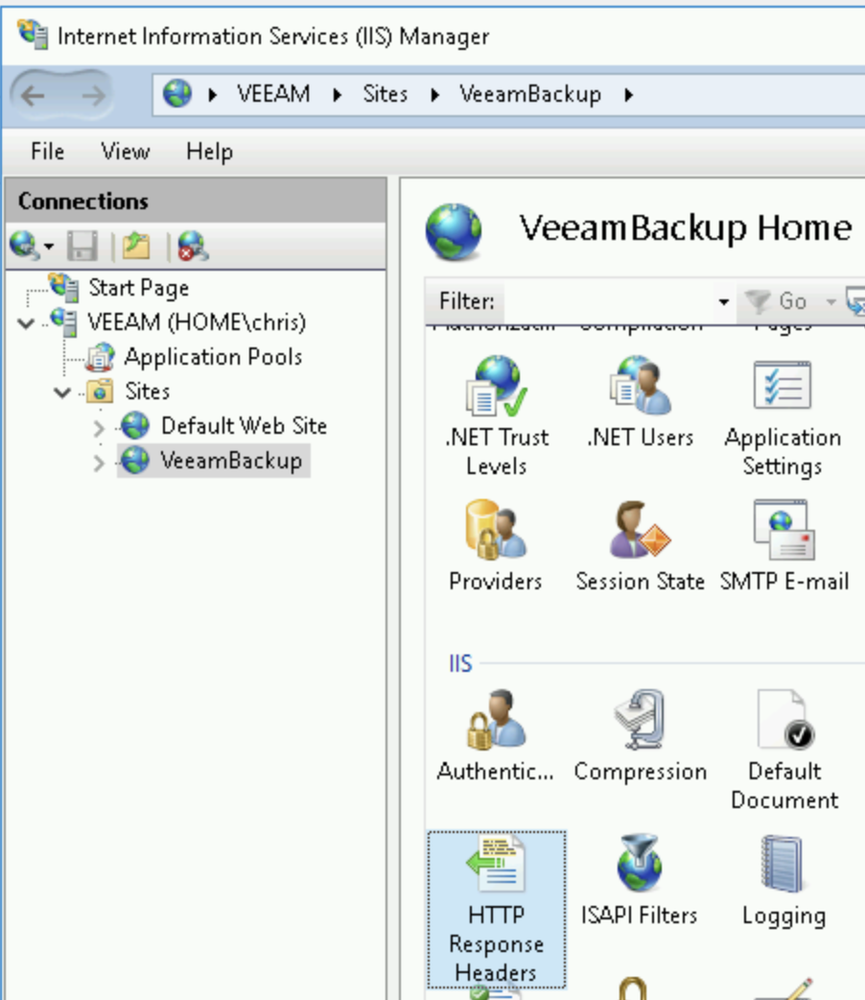
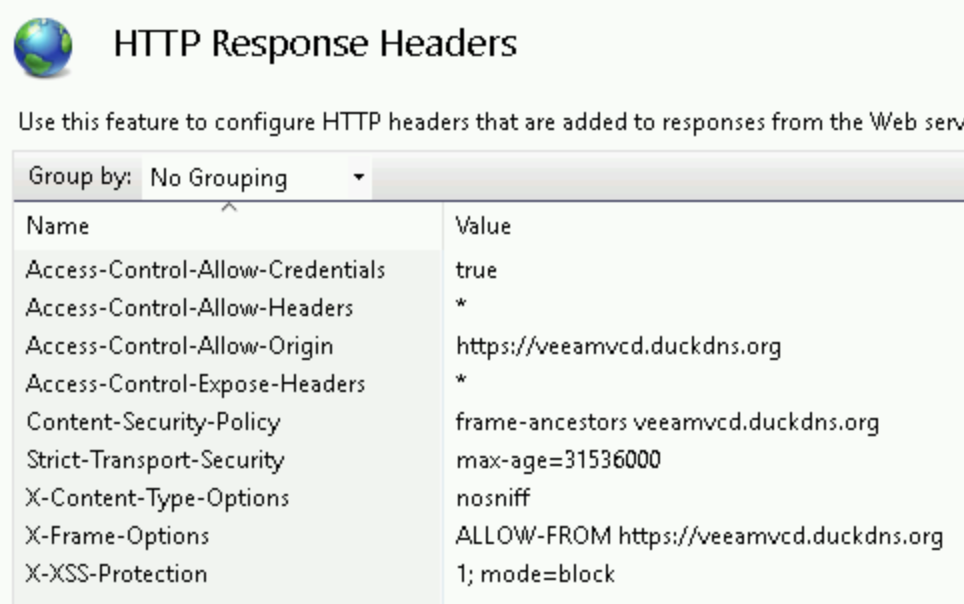
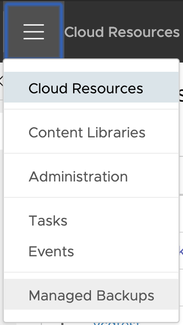
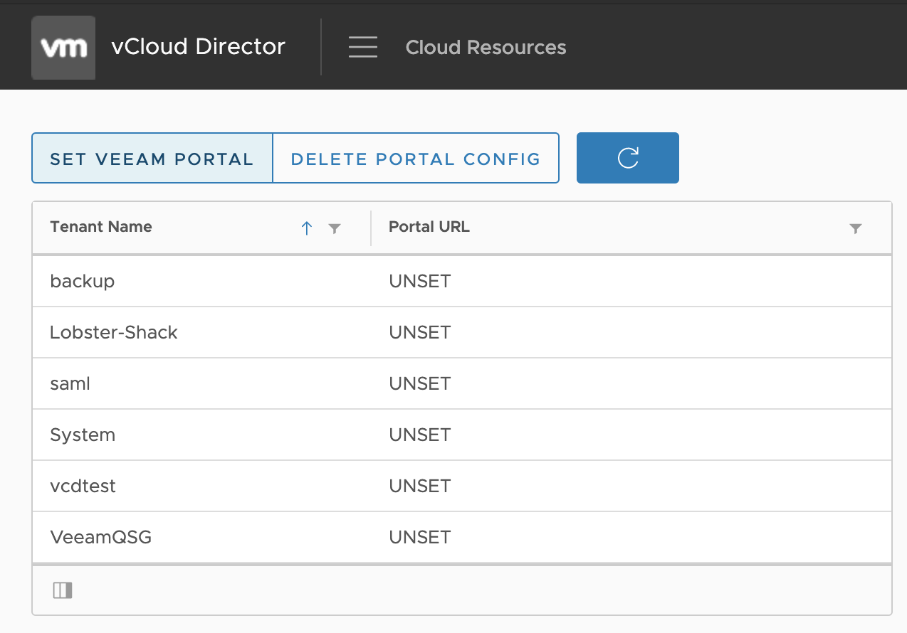
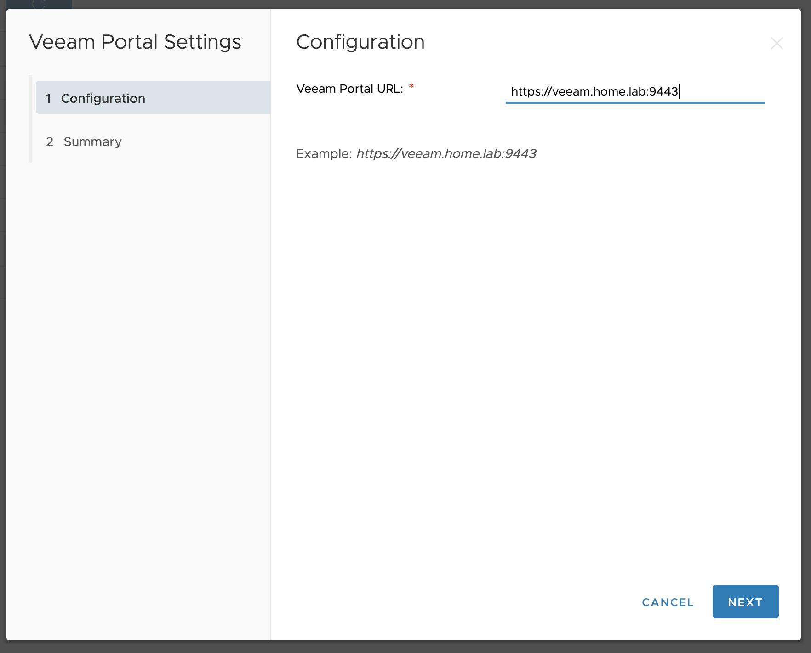
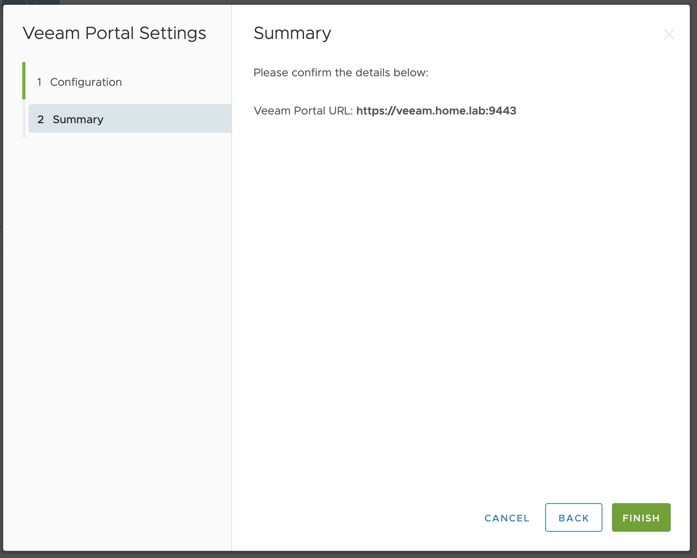
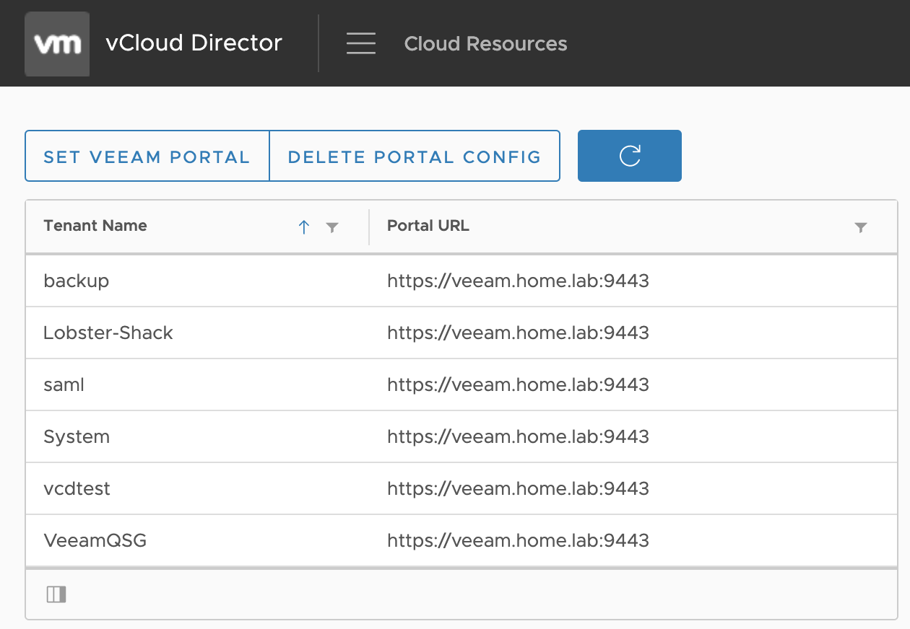

# Veeam vCloud Director (vCD) Plugin

*Super rough draft of documentation. Much to do here.*

This plugin uses the [Veeam vCD Self-Service Backup Portal](https://helpcenter.veeam.com/docs/backup/em/em_managing_vms_in_vcd_org.html?ver=95u4) and presents this portal  natively within the VMware vCloud Director Web UI.

* Supported vCD Versions
  * 9.1.0.2+
  * 9.5.x
  * 9.7.x

Current version of the plugin can be downloaded [here](https://github.com/carceneaux/plugin/releases/tag/v0.8).

## Enterprise Manager (EM) Requirements

As the Veeam vCD Plugin is fully reliant on the [Veeam vCD Self-Service Backup Portal](https://helpcenter.veeam.com/docs/backup/em/em_managing_vms_in_vcd_org.html?ver=95u4), it must be fully setup and accessible via the internet prior to plugin installation.

### Enterprise Manager Web Server must trust vCloud Director

As a secure web application, we'll need to make a few minor adjustments to the EM web server to avoid CORS policy violations. Please follow these required steps:

* On your EM server, open `Internet Information Services (IIS) Manager`
* Navigate to the `VeeamBackup` site (see screenshot below) and open `HTTP Response Headers`

* Add/Update the below entries:
  * Access-Control-Allow-Credentials: `true`
  * Access-Control-Allow-Headers: `*`
  * Access-Control-Allow-Origin: `<vCD URL>`
  * Access-Control-Expose-Headers: `*`
  * Content-Security-Policy: `frame-ancestors <vCD FQDN>`
  * X-Frame-Options: `ALLOW-FROM <vCD URL>`

Note the screenshot below. In this example, the vCD public URL is `https://veeamvcd.duckdns.org`.

## Installing Veeam Plugin

Veeam plugin installation can be completed using 2 different methods depending on your vCD environment. If you're using vCD 9.7, it's highly recommended you use the VMware Plugin Lifecycle Manager (Method 1). Otherwise, it most likely will be easier to use Method 2.

### Method 1 - Upload using VMware Plugin Lifecycle Manager

#### Requirements

* vCloud Director 9.7
  * VMware Plugin Lifecycle Manager comes pre-installed.
* vCloud Director 9.1.x/9.5.x
  * *NEED TO WRITE DOCUMENTATION FOR DEPLOYING [VMware Plugin Lifecycle Manager](https://github.com/vmware/vcd-ext-sdk/tree/master/ui/plugin-lifecycle)*

#### Steps

* Open `Plugin Lifecycle Management` from the Provider Portal
  * *Sample:* `https://vcd.home.lab/provider`
* Upload the `plugin.zip` and choose both *tenant*/*provider* scopes.
* *NEED TO WRITE MORE DETAILED STEPS WITH SCREENSHOTS*

### Method 2 - Upload using Python

*Newer Python 3 script exists. I'll migrate to that prior to first release.*

#### Requirements

* Python 2.7+
* Python libraries required:
  * `requests`
  * `configparser`

#### Steps

* Download the current plugin [here](https://github.com/carceneaux/plugin/releases/download/v0.8/veeam-vcd-plugin-v0.8.zip)
* Unzip the plugin on your computer
* Loosely follow these instructions: [Automated Deploy Method using Python](https://github.com/vmware/vcd-ext-sdk/tree/master/ui/vcd-plugin-seed#automated-deploy-method)
  * *INSTRUCTIONS TO BE IMPROVED*

## Configuring Veeam Plugin

* Open `Managed Backups` from the Provider Portal
  * *Sample:* `https://vcd.home.lab/provider`

* Click `Set Veeam Portal`

* Enter the public URL and port of your Enterprise Manager
* Click `NEXT`

* Confirm the URL entered is correct
* Click `FINISH`

* At this point, you'll see all vCD Organizations have had their Veeam Portal URL configured.
* vCD Tenants can now use the plugin

